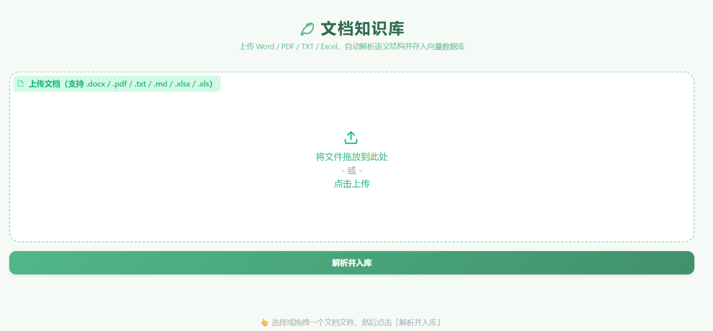
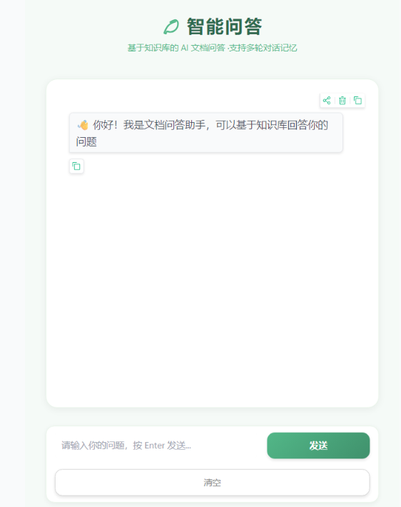
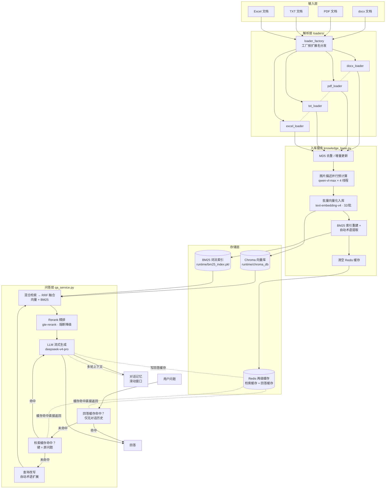

# Multi-Format RAG System

一个**本地、多格式**的知识库问答（RAG）系统：把 `docx / pdf / txt / excel` 文档解析、向量化、存入本地向量库，再基于检索结果调用大模型回答你的问题。

> 本项目为个人学习项目（v4.3），支持离线上库 + 在线问答两条流程，所有数据存本地，无需部署服务。

## 功能特性

- **多格式解析**：docx（含表格）、PDF、TXT、Excel 四类文档统一入库
- **文件级去重**：基于文件 MD5，重复文件自动跳过
- **本地向量库**：Chroma 持久化存储，重启不丢
- **表格感知**：docx 表格按行拆分为独立文档片段，保留结构语义
- **PDF 图文并重**：文本用 pdfplumber 抽取、含图页面用视觉模型转写
- **对话记忆**：滑动窗口记录最近 N 轮对话，支持多轮追问
- **Web 界面**：基于 Gradio，开箱即用
- **混合检索**：向量 + BM25 双路召回 → RRF 融合，专有名词不再漏召
- **查询改写自动化**：入库自动提取文档高频术语（`term_extractor.py` → `runtime/auto_dict.json`），查询时自动扩展（"成绩"→"学习成绩"），全程零手写
- **Rerank 精排**：API 精排把最相关片段排到最前，失败自动降级不阻塞
- **入库性能优化**：图片描述 4 线程并行 + 向量按批 32 提交（v4.0），实测 13 图 docx 入库 228s → 11.8s
- **IPv4 优先补丁**：自动跳过 IPv6 超时（v4.1 hotfix），embedding 单次 42.9s → 0.7s，网络差环境也能秒连
- **Redis 两级缓存**（v4.3）：检索 + 回答两级缓存，高频问题命中缓存直接返回（省 embedding / rerank / DeepSeek 成本）；Redis 未启动自动熔断降级为直连，问答不受影响

## 界面演示



*文档入库界面：拖拽上传，自动解析入库*



*智能问答界面：支持多轮对话记忆*

## 系统架构



**流程一句话**：入库时文档经对应 Loader 解析成文本片段 → 图片并行转写描述（qwen-vl-max）→ 批量向量化存入 Chroma，同时重建 BM25 索引并自动提取领域术语；问答时问题先查 Redis 两级缓存（检索 + 回答，命中直接返回，省 API 成本）→ 查询改写 → 混合检索（向量 + BM25）→ RRF 融合 → Rerank 精排 → 连同对话记忆交给 deepseek-v4-pro 流式生成回答；文档更新后自动清空缓存，Redis 未启动自动降级直连。

## 目录结构

```
.
├── app_file_loader.py   # Web 界面：文档入库（:7860）
├── app_chat.py          # Web 界面：对话问答（:7861）
├── config_data.py       # 全部配置（模型名、路径、检索参数）
├── loader_factory.py    # 加载器工厂（按扩展名分发）
├── knowledge_base.py    # 向量库操作（入库/检索/查询）
├── qa_service.py        # 问答服务（检索+LLM+视觉）
├── bm25_index.py       # BM25 词法索引（自实现，混合检索）
├── term_extractor.py   # 入库自动术语提取（v4.2，自动生成 auto_dict.json）
├── query_rewriter.py   # 查询改写（v4.2 自动词典版）
├── reranker.py         # Rerank 精排（API，熔断降级）
├── redis_cache.py       # Redis 两级缓存（v4.3，检索+回答，熔断降级）
├── ipv4_patch.py       # IPv4 优先补丁（v4.1 hotfix，幂等）
├── memory.py            # 对话记忆（滑动窗口）
├── loaders/             # 各类文档解析器
│   ├── base_loader.py   #   抽象基类
│   ├── docx_loader.py
│   ├── pdf_loader.py
│   ├── txt_loader.py
│   └── excel_loader.py
└── runtime/             # 运行时数据（自动生成，不入库）
    ├── chroma_db/       #   向量库
    ├── output/          #   提取的图片
    ├── file_md5.txt     #   去重记录
    ├── auto_dict.json   #   自动术语词典（入库时生成）
    └── conversation_memory.jsonl  #   对话历史
```

## 快速开始

### 1. 环境要求

- Python 3.9+
- 具备两个模型服务的 API Key（见下）

### 2. 安装依赖

```bash
pip install -r requirements.txt
```

### 2.1 Redis 缓存（可选）

Redis 用于缓存高频问答结果（v4.3）。**不安装 / 不启动也不影响使用**：系统自动降级为直连；启动后命中缓存可省 API 费用、加快响应。

```bash
pip install redis
redis-server   # 启动 Redis（Windows 可下载 redis-windows 或 Memurai）
```

### 3. 配置 API Key（必做）

本项目不内置任何 Key，模型服务通过**环境变量**鉴权：

```bash
# Windows PowerShell
$env:DASHSCOPE_API_KEY = "你的通义千问Key"
$env:DEEPSEEK_API_KEY  = "你的DeepSeek Key"

# Linux / macOS
export DASHSCOPE_API_KEY="你的通义千问Key"
export DEEPSEEK_API_KEY="你的DeepSeek Key"
```

| 环境变量 | 用途 | 获取地址 |
|---|---|---|
| `DASHSCOPE_API_KEY` | 嵌入模型 + 视觉模型（阿里云百炼） | https://bailian.console.aliyun.com |
| `DEEPSEEK_API_KEY` | 对话模型（DeepSeek 开放平台） | https://platform.deepseek.com |

### 4. 修改模型（可选）

默认模型在 `config_data.py` 顶部，按需改成你自己开通的模型：

```python
EMBEDDING_MODEL = "text-embedding-v4"   # 嵌入模型（通义千问）
CHAT_MODEL      = "deepseek-v4-pro"     # 对话模型（DeepSeek）
VISION_MODEL    = "qwen-vl-max"         # 视觉模型（通义千问）
```

### 5. 使用

**① 文档入库**（把文档丢进知识库，浏览器打开 Gradio）：

```bash
python app_file_loader.py
# 浏览器访问 http://127.0.0.1:7860
```

**② 启动问答界面**（浏览器打开 Gradio）：

```bash
python app_chat.py
# 浏览器访问 http://127.0.0.1:7861
```

## 常见问题 FAQ

**Q1：入库报错提示缺少 API Key？**
检查是否已设置 `DASHSCOPE_API_KEY` / `DEEPSEEK_API_KEY`，PowerShell 用 `$env:变量名 = "..."`，设置后需重新打开终端或在同一终端运行。

**Q2：想换其他模型？**
修改 `config_data.py` 顶部的 `EMBEDDING_MODEL` / `CHAT_MODEL` / `VISION_MODEL`，前提是你的 Key 有对应模型的调用权限。

**Q3：重复入库同一份文件？**
系统按文件 MD5 自动去重，同一文件重复提交会提示已存在。

**Q4：runtime/ 目录会自动生成？**
是的，向量库、提取图片、去重记录都在 `runtime/` 下自动生成，已被 `.gitignore` 忽略，删除该目录不影响代码。

**Q5：查询改写的词典在哪？需要手动维护吗？**
不需要。`runtime/auto_dict.json` 由 `term_extractor.py` 在每次文档入库时自动生成/更新（自动提取文档高频实词），查询时 `query_rewriter.py` 自动匹配扩展。你只需正常入库文档即可，全程零手写。

**Q6：Rerank 功能需要额外配置吗？**
需要。系统内置 Rerank 精排（`reranker.py`，默认模型 `gte-rerank`），但 **Rerank 依赖你自行开通阿里云百炼的 `gte-rerank` 模型**（模型广场搜索「文本排序」开通，通常有免费额度）。未开通时系统自动降级为 RRF 排序，问答功能不受影响；开通后无需改代码，重启即生效。

**Q7：Redis 缓存（v4.3）必须要安装吗？**
不需要。`redis_cache.py` 内置熔断降级：Redis 未启动 / 连接失败时自动跳过缓存直连问答（只打印一次提示），功能完全正常；想启用缓存只需 `pip install redis` 并启动 `redis-server`。文档更新时系统会自动清空旧缓存，无需手动处理。

## 项目演进

| 版本 | 内容 |
|---|---|
| v1.0 | 仅支持 docx 解析入库 + 基础问答 |
| v2.0 | 支持 pdf/txt/excel；表格感知解析；文件 MD5 去重；对话记忆；Gradio 界面 |
| v3.0 | 检索增强：混合检索（BM25 + RRF）、查询改写、Rerank 精排 |
| v4.0 | 入库性能优化：图片描述并行（4 线程）+ 向量批量提交（32/批） |
| v4.1 | 性能 hotfix：IPv4 优先补丁，修复 IPv6 超时导致的 API 慢连接（实测提速 ~60 倍） |
| v4.2 | 查询改写自动化：入库自动术语提取（term_extractor → auto_dict.json），查询自动扩展，零手写 |
| v4.3 | Redis 两级缓存：检索 + 回答缓存，高频问题命中直接返回，省 API 成本；未启动自动降级直连 |

## License

[MIT](./LICENSE)
